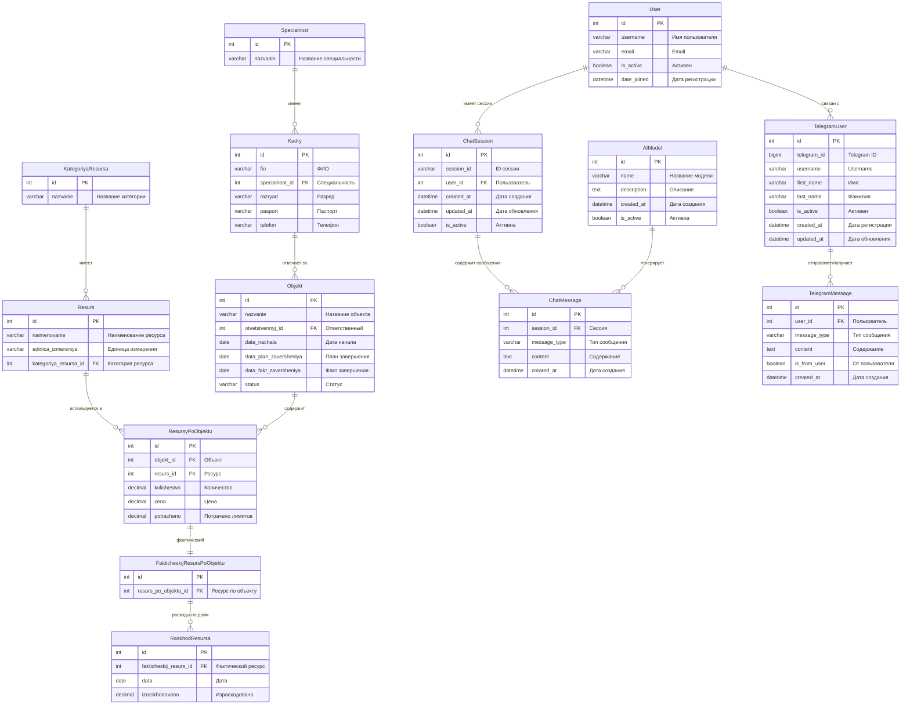

# Схема базы данных AI-ZAM

## ER-диаграмма



## Диаграмма классов

```mermaid
classDiagram
    %% Основные классы строительной системы
    class KategoriyaResursa {
        +id: int
        +nazvanie: str
        +__str__()
    }
    
    class Resurs {
        +id: int
        +naimenovanie: str
        +edinica_izmereniya: str
        +kategoriya_resursa: FK
        +__str__()
    }
    
    class Specialnost {
        +id: int
        +nazvanie: str
        +__str__()
    }
    
    class Kadry {
        +id: int
        +fio: str
        +specialnost: FK
        +razryad: str
        +pasport: str
        +telefon: str
        +__str__()
    }
    
    class Objekt {
        +id: int
        +nazvanie: str
        +otvetstvennyj: FK
        +data_nachala: date
        +data_plan_zaversheniya: date
        +data_fakt_zaversheniya: date
        +status: str
        +__str__()
    }
    
    class ResursyPoObjektu {
        +id: int
        +objekt: FK
        +resurs: FK
        +kolichestvo: decimal
        +cena: decimal
        +potracheno: decimal
        +__str__()
    }
    
    class FakticheskijResursPoObjektu {
        +id: int
        +resurs_po_objektu: FK
        +__str__()
    }
    
    class RaskhodResursa {
        +id: int
        +fakticheskij_resurs: FK
        +data: date
        +izraskhodovano: decimal
        +__str__()
    }
    
    %% AI и чат классы
    class AIModel {
        +id: int
        +name: str
        +description: text
        +created_at: datetime
        +is_active: bool
        +__str__()
    }
    
    class ChatSession {
        +id: int
        +session_id: str
        +user: FK
        +created_at: datetime
        +updated_at: datetime
        +is_active: bool
        +__str__()
    }
    
    class ChatMessage {
        +id: int
        +session: FK
        +message_type: str
        +content: text
        +created_at: datetime
        +__str__()
    }
    
    %% Telegram классы
    class TelegramUser {
        +id: int
        +telegram_id: bigint
        +username: str
        +first_name: str
        +last_name: str
        +is_active: bool
        +created_at: datetime
        +updated_at: datetime
        +__str__()
    }
    
    class TelegramMessage {
        +id: int
        +user: FK
        +message_type: str
        +content: text
        +is_from_user: bool
        +created_at: datetime
        +__str__()
    }
    
    %% Связи
    KategoriyaResursa ||--o{ Resurs
    Resurs ||--o{ ResursyPoObjektu
    Objekt ||--o{ ResursyPoObjektu
    Kadry ||--o{ Objekt
    Specialnost ||--o{ Kadry
    ResursyPoObjektu ||--|| FakticheskijResursPoObjektu
    FakticheskijResursPoObjektu ||--o{ RaskhodResursa
    ChatSession ||--o{ ChatMessage
    TelegramUser ||--o{ TelegramMessage
```

## Описание таблиц

### Строительная система

| Таблица | Описание | Ключевые поля |
|---------|----------|---------------|
| `kategoriya_resursa` | Категории ресурсов (кадры, материалы, механизмы) | `id`, `nazvanie` |
| `resurs` | Ресурсы (конкретные наименования) | `id`, `naimenovanie`, `kategoriya_resursa_id` |
| `specialnost` | Специальности кадров | `id`, `nazvanie` |
| `kadry` | Кадры (работники) | `id`, `fio`, `specialnost_id` |
| `objekt` | Строительные объекты | `id`, `nazvanie`, `otvetstvennyj_id`, `status` |
| `resursy_po_objektu` | Планируемые ресурсы по объектам | `id`, `objekt_id`, `resurs_id`, `kolichestvo`, `cena` |
| `fakticheskij_resurs_po_objektu` | Фактические ресурсы | `id`, `resurs_po_objektu_id` |
| `raskhod_resursa` | Расходы ресурсов по дням | `id`, `fakticheskij_resurs_id`, `data`, `izraskhodovano` |

### AI и чат система

| Таблица | Описание | Ключевые поля |
|---------|----------|---------------|
| `ai_aimodel` | AI модели | `id`, `name`, `description` |
| `ai_chatsession` | Сессии чата | `id`, `session_id`, `user_id` |
| `ai_chatmessage` | Сообщения чата | `id`, `session_id`, `message_type`, `content` |

### Telegram система

| Таблица | Описание | Ключевые поля |
|---------|----------|---------------|
| `telegrambot_telegramuser` | Пользователи Telegram | `id`, `telegram_id`, `username` |
| `telegrambot_telegrammessage` | Сообщения Telegram | `id`, `user_id`, `content`, `is_from_user` |

## Основные связи

1. **Объект → Ресурсы**: Один объект может иметь много ресурсов
2. **Ресурс → Категория**: Каждый ресурс принадлежит одной категории
3. **Кадры → Специальность**: Каждый кадр имеет одну специальность
4. **Объект → Ответственный**: Каждый объект может иметь одного ответственного
5. **Планируемые → Фактические ресурсы**: 1:1 связь
6. **Фактические ресурсы → Расходы**: 1:много связь по дням
7. **Пользователи → Сессии чата**: 1:много связь
8. **Сессии → Сообщения**: 1:много связь
9. **Telegram пользователи → Сообщения**: 1:много связь 