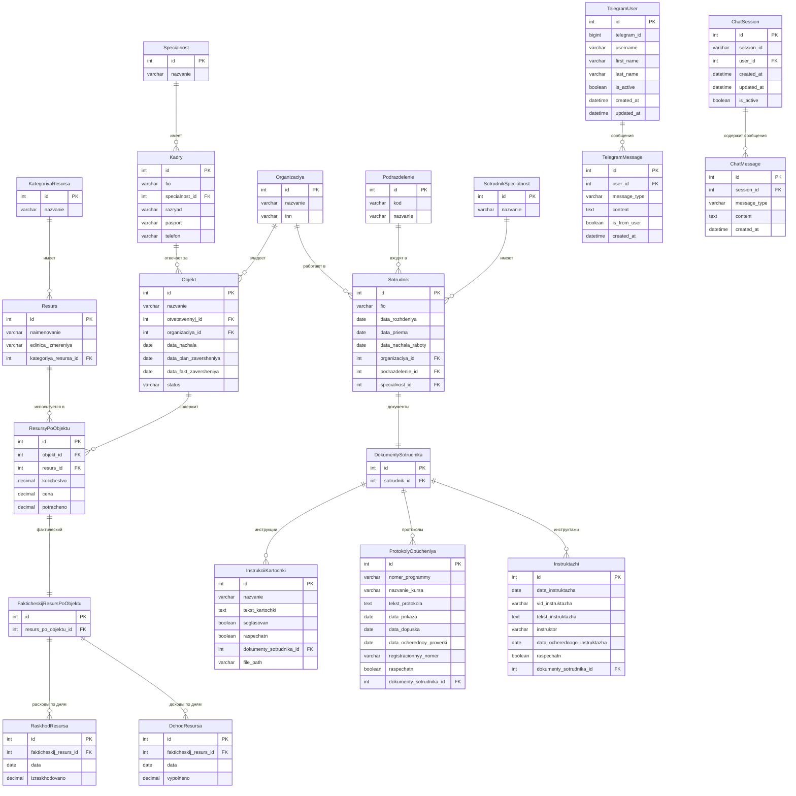

# Схема базы данных AI-ZAM (Обновленная версия)

## ER-диаграмма

## Описание таблиц

### Строительная система

| Таблица | Описание | Ключевые поля |
|---------|----------|---------------|
| `kategoriya_resursa` | Категории ресурсов (кадры, материалы, механизмы) | `id`, `nazvanie` |
| `resurs` | Ресурсы (конкретные наименования) | `id`, `naimenovanie`, `kategoriya_resursa_id` |
| `object_specialnost` | Специальности кадров | `id`, `nazvanie` |
| `kadry` | Кадры (работники) | `id`, `fio`, `specialnost_id` |
| `objekt` | Строительные объекты | `id`, `nazvanie`, `otvetstvennyj_id`, `organizaciya_id`, `status` |
| `resursy_po_objektu` | Планируемые ресурсы по объектам | `id`, `objekt_id`, `resurs_id`, `kolichestvo`, `cena`, `potracheno` |
| `fakticheskij_resurs_po_objektu` | Фактические ресурсы | `id`, `resurs_po_objektu_id` |
| `raskhod_resursa` | Расходы ресурсов по дням | `id`, `fakticheskij_resurs_id`, `data`, `izraskhodovano` |
| `dokhod_resursa` | Доходы ресурсов по дням | `id`, `fakticheskij_resurs_id`, `data`, `vypolneno` |
| `kategoriya_po_objektu` | Категории по объектам | `id`, `kategoriya_id`, `objekt_id` |
| `svodnaya_raskhod_dokhod_po_dnyam` | Сводная по расходам/доходам | `id`, `objekt_id`, `data`, `raskhod`, `dokhod`, `balans` |

### Система сотрудников

| Таблица | Описание | Ключевые поля |
|---------|----------|---------------|
| `sotrudniki_organizaciya` | Организации | `id`, `nazvanie`, `inn` |
| `sotrudniki_podrazdelenie` | Подразделения | `id`, `kod`, `nazvanie` |
| `sotrudniki_specialnost` | Специальности сотрудников | `id`, `nazvanie` |
| `sotrudniki_sotrudnik` | Сотрудники | `id`, `fio`, `data_rozhdeniya`, `organizaciya_id`, `podrazdelenie_id`, `specialnost_id` |
| `sotrudniki_dokumentysotrudnika` | Документы сотрудника | `id`, `sotrudnik_id` |
| `sotrudniki_instrukciikartochki` | Инструкции и карточки | `id`, `nazvanie`, `dokumenty_sotrudnika_id`, `file_path` |
| `sotrudniki_protokolyobucheniya` | Протоколы обучения | `id`, `nomer_programmy`, `nazvanie_kursa`, `dokumenty_sotrudnika_id` |
| `sotrudniki_instruktazhi` | Инструктажи | `id`, `data_instruktazha`, `vid_instruktazha`, `dokumenty_sotrudnika_id` |
| `sotrudniki_vidydokumentov` | Виды документов | `id`, `nazvanie`, `tip` |

### AI и чат система

| Таблица | Описание | Ключевые поля |
|---------|----------|---------------|
| `ai_aimodel` | AI модели | `id`, `name`, `description` |
| `ai_chatsession` | Сессии чата | `id`, `session_id`, `user_id` |
| `ai_chatmessage` | Сообщения чата | `id`, `session_id`, `message_type`, `content` |

### Telegram система

| Таблица | Описание | Ключевые поля |
|---------|----------|---------------|
| `telegrambot_telegramuser` | Пользователи Telegram | `id`, `telegram_id`, `username` |
| `telegrambot_telegrammessage` | Сообщения Telegram | `id`, `user_id`, `content`, `is_from_user` |
| `telegrambot_temporarydocument` | Временные документы | `id`, `content`, `user_id` |

## Основные связи

### Строительная система
1. **Объект → Ресурсы**: Один объект может иметь много ресурсов
2. **Ресурс → Категория**: Каждый ресурс принадлежит одной категории
3. **Кадры → Специальность**: Каждый кадр имеет одну специальность
4. **Объект → Ответственный**: Каждый объект может иметь одного ответственного
5. **Объект → Организация**: Каждый объект принадлежит организации
6. **Планируемые → Фактические ресурсы**: 1:1 связь
7. **Фактические ресурсы → Расходы/Доходы**: 1:много связь по дням
8. **Объект → Категории**: Много ко многим через `kategoriya_po_objektu`

### Система сотрудников
9. **Организация → Сотрудники**: 1:много связь
10. **Подразделение → Сотрудники**: 1:много связь
11. **Специальность → Сотрудники**: 1:много связь
12. **Сотрудник → Документы**: 1:1 связь
13. **Документы → Инструкции/Протоколы/Инструктажи**: 1:много связь

### AI и чат система
14. **Пользователи → Сессии чата**: 1:много связь
15. **Сессии → Сообщения**: 1:много связь
16. **Telegram пользователи → Сообщения**: 1:много связь

## Новые возможности

### Управление сотрудниками
- Ведение личных дел сотрудников
- Управление документооборотом
- Протоколы обучения и инструктажи
- Привязка к организациям и подразделениям

### Доходная часть проектов
- Учет выполненных работ по дням
- Сопоставление доходов и расходов
- Сводная отчетность по балансу проекта

### Расширенная аналитика
- Детализация по категориям ресурсов
- Временные ряды доходов и расходов
- Контроль выполнения планов